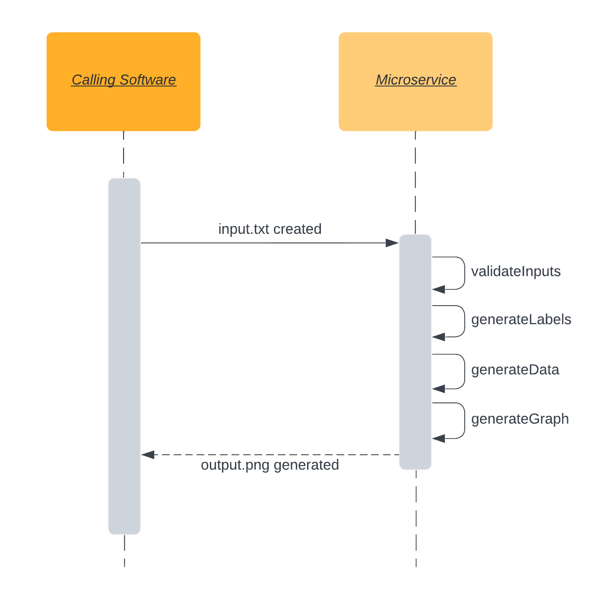

My partner has requested that files (.txt and .png) be used as the pipe for this microservice.

To function, the microservice must be running locally. The service may be started using the following command.
```
node index.js
```

## Requesting Data

To request a new graph be generated, place a file named "input.txt" in the root directory of the microservice with the following data.
```
Principle Balance (Number > 0)
Number of Years (Number >= 1)
Interest Rate (Number within [1, 100])
Number of compounds per year (Number within [1, 365])
```

**Example Input:**
$1,000 compounded daily for 5 years at a rate of 10% per year
```
1000
5
10
365
```

## Receiving Data

Once detected, input.txt will be deleted and replaced with a file named "output.png" containing the requested graph.
If a new input.txt is provided, output.png will be overridden.
A new input is scanned for once every 1000 ms.

## UML Sequence Diagram

